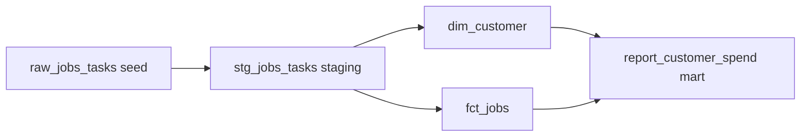

# dbt Dimensional Model

A dbt project that transforms raw operational data into a clean, tested, documented dimensional model, with automatic data lineage. It runs entirely on your machine using DuckDB, so there is no database server to install and no cloud account required.

> **Note on data:** This repository uses only synthetic, generated data. It contains no real or proprietary information. A generator script and dbt seed are included so anyone can reproduce the full model.

## Why this project

Raw operational data is rarely shaped for analysis. dbt is the modern standard for turning it into trustworthy reporting tables. This project shows the full pattern that data teams use in production:

- A layered build, from raw to cleaned staging to business ready marts
- Built in data quality tests that fail loudly when an assumption breaks
- Documentation and an automatic lineage graph showing how every table is derived

It is the same raw to clean to report layering done by hand in many shops, but version controlled, automatically ordered by dependency, tested, and documented.

## What are dbt and DuckDB

**dbt** (data build tool) manages SQL transformations as version controlled models. You write SELECT statements, and dbt handles creating the tables, running them in the right order, testing them, and documenting them.

**DuckDB** is a fast, file based analytical database that installs as a simple Python package. It needs no server and no account, which lets this whole project run locally for anyone.

## Lineage



## The model layers

1. **Seed.** The synthetic raw data (`raw_jobs_tasks.csv`) is loaded into DuckDB with `dbt seed`.
2. **Staging** (`stg_jobs_tasks`). Cleans and standardizes the raw data: trims text, casts types, classifies proactive versus reactive, and normalizes status.
3. **Marts.** Business ready tables:
   - `dim_customer`, one row per customer (a dimension)
   - `fct_jobs`, one row per job with measures (a fact)
   - `report_customer_spend`, a reporting table joining the two

## Data quality tests

The project defines tests in `schema.yml`, for example that key columns are never null and that the customer key is unique. Running `dbt test` checks them all and reports any failures, which is how dbt enforces data quality automatically.

## Tech stack

- **dbt** with the **dbt-duckdb** adapter for transformations, testing, and docs
- **DuckDB** as the local analytical database
- **Python** for the synthetic data generator

## Repository structure

```
dbt-dimensional-model/
  README.md
  LICENSE
  .gitignore
  requirements.txt
  dbt_project.yml              dbt project configuration
  profiles.yml                 local DuckDB connection
  generate_synthetic_data.py   creates the raw seed CSV
  seeds/
    raw_jobs_tasks.csv          raw synthetic data (created by the generator)
  models/
    staging/
      stg_jobs_tasks.sql
    marts/
      dim_customer.sql
      fct_jobs.sql
      report_customer_spend.sql
    schema.yml                  model documentation and data tests
```

## Run it yourself

**Prerequisites:** Python 3.

1. Clone this repository.
2. Install the packages: `pip install -r requirements.txt`
3. Generate the raw seed data: `python generate_synthetic_data.py`
4. Load the seed into DuckDB: `dbt seed --profiles-dir .`
5. Build the models: `dbt run --profiles-dir .`
6. Run the tests: `dbt test --profiles-dir .`
7. View documentation and lineage: `dbt docs generate --profiles-dir .` then `dbt docs serve --profiles-dir .`

## What this project demonstrates

- Dimensional modeling with clean staging, dimensions, facts, and a reporting mart
- The modern data stack in practice: dbt for transformation, testing, and lineage
- Automated data quality testing
- Documentation and lineage that make a data model transparent and maintainable

## License

Released under the MIT License. See the LICENSE file for details.
